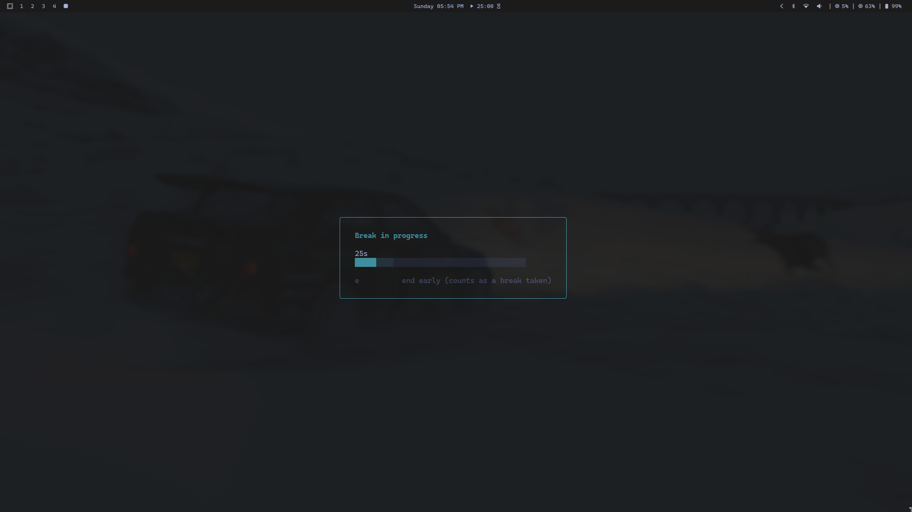

## hypr-breaktimer

Tiny Go + Bubble Tea break reminder for Hyprland.

### About

`hypr-breaktimer` is a tiny, terminal-based break reminder designed to fit into a Hyprland workflow without getting in your way.

- Runs headless on a timer (`tick`) and only opens a UI when a break is due.
- Uses a simple, motivational popup you can interact with via keyboard (start break / snooze / end early).
- Stores config/state in standard XDG locations (easy to back up and inspect).
- Includes a focus mode (temporary block / do-not-disturb) so you can suppress scheduled popups during meetings or deep work.




### Commands

- `hypr-breaktimer show`: force open the popup UI immediately
- `hypr-breaktimer tick`: headless scheduler entrypoint (spawns popup when due)
- `hypr-breaktimer status`: print current config/state and next due time
- `hypr-breaktimer block <duration>`: suppress scheduled popups for a duration (`0` = do not disturb)
- `hypr-breaktimer unblock`: disable do not disturb and clear any active block

### Config

- Path: `~/.config/hypr-breaktimer/config.toml`
- Defaults: work interval 30m, break 5m, snooze 10m

### State

- Path: `~/.local/state/hypr-breaktimer/state.json`
- Lock: `~/.local/state/hypr-breaktimer/lock`

### Focus mode

Temporarily suppress scheduled popups (affects `tick` only; `show` still works):

```bash
hypr-breaktimer block 90m
hypr-breaktimer block 2h
```

also supports raw numbers (in minutes): e.g. 120 = 120 minutes = 2 hours

```bash
hypr-breaktimer block 120
```

Enable do not disturb until you turn it off:

```bash
hypr-breaktimer block 0
hypr-breaktimer unblock
```

Note: closing the popup (quit) counts as completing a break for scheduling.

### Terminal launching

- `show`/`tick` open the UI in a new terminal.
- Launcher: `xdg-terminal-exec` (recommended; respects your configured default terminal and supports app-id/title)

### Install (from source)

Dependencies (Arch examples):

- Go (build): `pacman -S go`
- Terminal launcher (runtime): `pacman -S xdg-terminal-exec`

Install (per-user, to `~/.local/bin`):

```bash
git clone https://github.com/Aayushstha03/hypr-breaktimer
cd hypr-breaktimer
./install.sh
```

What `install.sh` does:

- Builds `hypr-breaktimer` from source.
- Installs it to `~/.local/bin/hypr-breaktimer`.
- Creates `~/.config/hypr-breaktimer/config.toml` if it does not already exist (from `config/config.toml.example`).
- Installs and enables a systemd user timer by default.

Skip systemd integration:

```bash
./install.sh --no-timer
```

### systemd (user)

These are the exact unit files installed by `install.sh`:

`~/.config/systemd/user/hypr-breaktimer.service`

```ini
[Unit]
Description=hypr-breaktimer (check if break is due)

[Service]
Type=oneshot
KillMode=process
ExecStart=%h/.local/bin/hypr-breaktimer tick
```

`~/.config/systemd/user/hypr-breaktimer.timer`

```ini
[Unit]
Description=Run hypr-breaktimer periodically

[Timer]
OnActiveSec=1m
OnUnitActiveSec=60s
Persistent=true

[Install]
WantedBy=timers.target
```

Manage the timer:

```bash
systemctl --user daemon-reload
systemctl --user enable --now hypr-breaktimer.timer
systemctl --user status hypr-breaktimer.timer
```

### Uninstall

```bash
./uninstall.sh
```

Remove config/state too:

```bash
./uninstall.sh --purge
```

### Hyprland

- When launched via `xdg-terminal-exec`, the popup uses `app_id` and `title` from your config so you can match it in window rules.
- Defaults: `hypr-breaktimer-popup`.

Example rules:

```ini
windowrule = opacity 0.8 0.8, match:title ^(hypr-breaktimer-popup)$
windowrule = maximize on, match:title ^(hypr-breaktimer-popup)$
```
